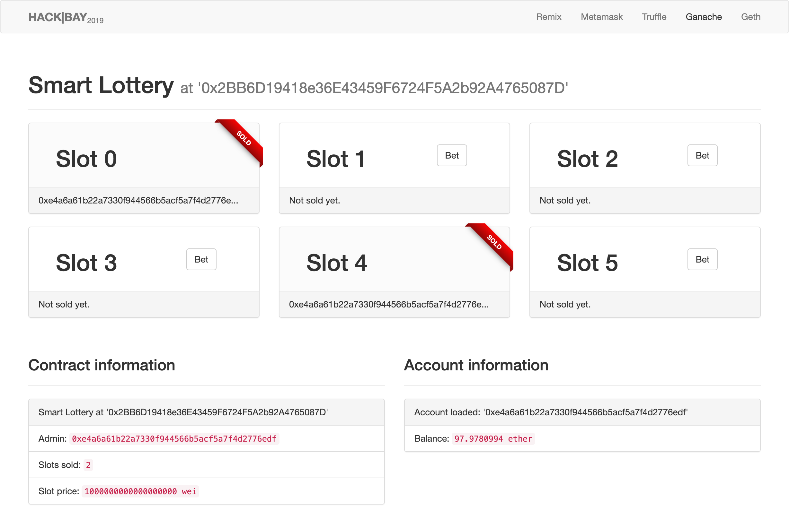

# Smart Contract Workshop

### Get dependencies

Make sure, all packages are installed. Since you switched branches, type `npm install` again to get all
missing packages for the frontend application in your project's main `SmartLottery` directory.

### Make sure ganache-cli is running

Run `ganache-cli -m "carry easy spice pupil expand later night jewel screen torch advance turkey"`
with replacing your own 12 word seed phrase.

### Run the frontend

Type `npm run dev` in a new command line window from the projects base directoy.
The website should correctly display "Smart Lottery not deployed."

### Import accounts in Metamask

Either using the private keys or 12 word the seed phrase, import the accounts needed to play the lottery into Metamask.
When refreshing the fronted, you should be able to see the chosen account's address as well as the balance of 100 ethers.

### Deploy the contract

When ganache is running, run `truffle migrate --all` to (re)deploy all contracts defined.
Deployment will take a while, afterwards, if you refresh the fronted application, your base account should have less than 100 ethers as
it was used to deploy the Smart Lottery contract. Also, the headline should now tell you the contract address as well as its parameters.

### Play the lottery!

Everything should be set up now to interact with your contract with Metamask.
Click the "Bet" button on any slot to buy it. A winner will be chosen after all slots are sold and the lottery will be reset.

